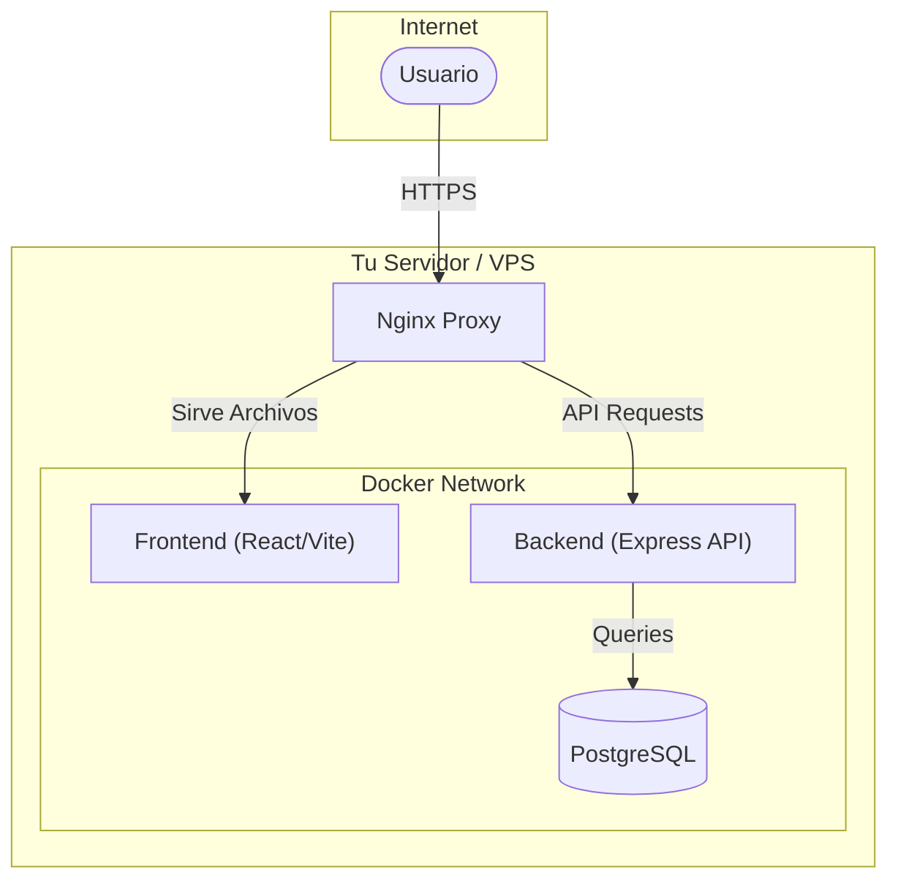

# 💰 Finanzas Pro

> **Sistema integral de gestión financiera personal** — Self-hosted, privado, open source y completamente tuyo.

[](https://www.typescriptlang.org/)
[](https://react.dev/)
[](https://expressjs.com/)
[](https://www.postgresql.org/)
[](https://www.docker.com/)
[](LICENSE)
[](https://github.com/herwingx/finanzas-pro/actions/workflows/deploy.yml)

<p align="center">
  
</p>

---

## 📋 Tabla de Contenidos

- [✨ Características](#-características)
- [⚡ Guía Rápida para Forks](#-guía-rápida-para-forks)
- [🔐 Configuración Detallada](#-configuración-detallada)
- [🚀 Despliegue Paso a Paso](#-despliegue-paso-a-paso)
- [🏗️ Arquitectura](#️-arquitectura)
- [📚 Documentación](#-documentación)
- [🤝 Contribuir](#-contribuir)

---

## ✨ Características

| Característica          | Descripción                                    |
| :---------------------- | :--------------------------------------------- |
| 🏦 **Multi-cuenta**      | Gestiona cuentas de débito, crédito y efectivo |
| 💳 **Compras MSI**       | Control de compras a meses sin intereses       |
| 🔄 **Recurrentes**       | Automatiza ingresos y gastos fijos             |
| 💸 **Préstamos**         | Registra dinero prestado o debido              |
| 📊 **Regla 50/30/20**    | Análisis financiero inteligente                |
| 📱 **Mobile-First**      | PWA optimizada con gestos swipe                |
| 🌓 **Tema Oscuro/Claro** | Diseño premium adaptativo                      |
| 🔒 **Self-Hosted**       | Tus datos, tu servidor                         |

---

## ⚡ Guía Rápida para Forks

Si acabas de hacer fork de este proyecto y quieres ponerlo en marcha rápidamente, sigue estos pasos críticos.

### 1. Clonar tu fork

```bash
git clone https://github.com/TU_USUARIO/finanzas-pro.git
cd finanzas-pro
```

### 2. Configuración Inicial Automática

Hemos preparado scripts para facilitar la configuración inicial si estás en Linux/Mac:

```bash
# Copia las plantillas de variables de entorno automáticamente
cp .env.example .env
cp backend/.env.example backend/.env
```

### 3. Personalizar Secretos (Obligatorio)

Como este es un sistema financiero, la seguridad es crítica. **Nunca** uses los valores por defecto en producción.

```bash
# Genera tus propias credenciales seguras
nano .env
# Edita: POSTGRES_PASSWORD, CLOUDFLARE_TUNNEL_TOKEN

nano backend/.env
# Edita: JWT_SECRET, DATABASE_URL (asegúrate que coincida con POSTGRES_PASSWORD)
```

> **Nota:** Si no planeas usar Cloudflare Tunnel inicialmente, puedes dejar esa variable vacía, pero se recomienda para acceso seguro sin abrir puertos.

---

## 🔐 Configuración Detallada

El sistema se configura mediante dos archivos de entorno principales. Aquí te explicamos cada variable crítica.

### Archivo Raíz `.env`
Configura la infraestructura (Docker, Base de Datos, Red).

| Variable | Importancia | Descripción |
| :--- | :--- | :--- |
| `POSTGRES_USER` | **Alta** | Usuario maestro de la base de datos (def: `finanzas`). |
| `POSTGRES_PASSWORD` | **Crítica** | Contraseña de la BD. ¡Cámbiala inmediatamente! |
| `POSTGRES_DB` | Media | Nombre de la base de datos (def: `finanzas_pro`). |
| `CLOUDFLARE_TUNNEL_TOKEN` | **Crítica** | Token obtenido de Cloudflare Zero Trust para exponer tu app de forma segura. |

### Archivo Backend `backend/.env`
Configura la lógica de la aplicación y conexión a datos.

| Variable | Importancia | Descripción |
| :--- | :--- | :--- |
| `DATABASE_URL` | **Crítica** | String de conexión completo. Debe coincidir con las credenciales del root `.env`.<br>Formato: `postgresql://USER:PASSWORD@db:5432/DB_NAME` |
| `JWT_SECRET` | **Crítica** | Llave maestra para firmar sesiones de usuarios. Usa un string largo y aleatorio. |
| `PORT` | Baja | Puerto interno del contenedor (def: `4000`). No suele requerir cambios. |
| `NODE_ENV` | Media | `production` para despliegue real, `development` para pruebas locales. |

---

## 🚀 Despliegue Paso a Paso

Ofrecemos un script de utilidad `deploy.sh` que automatiza todo el ciclo de vida de la aplicación con Docker.

### Pre-requisitos
- Docker y Docker Compose v2+ instalados.
- Puertos `80` y `443` libres (si no usas Cloudflare Tunnel).

### Método 1: Despliegue Automático (Recomendado)

Este método levanta la infraestructura, construye las imágenes, ejecuta migraciones y levanta los servicios.

**Paso 1: Dar permisos al script**
```bash
chmod +x deploy.sh
```

**Paso 2: Iniciar la aplicación**
```bash
./deploy.sh start
```
*Este comando construirá el frontend y backend, iniciará la base de datos y conectará el túnel.*

**Paso 3: Verificar estado**
```bash
./deploy.sh status
```

### Método 2: Despliegue Manual (Docker Compose)

Si prefieres entender qué pasa "bajo el capó" o no puedes usar el script:

1. **Levantar servicios:**
   ```bash
   docker compose up -d --build
   ```

2. **Esperar a que la base de datos esté lista.**

3. **Ejecutar migraciones de base de datos:**
   ```bash
   docker compose exec backend npx prisma migrate deploy
   ```
   *Esto crea las tablas necesarias en tu nueva base de datos PostgreSQL.*

4. **Verificar logs:**
   ```bash
   docker compose logs -f
   ```

### Acceso a la Aplicación

- **Vía Cloudflare:** `https://tudominio.com` (Si configuraste el tunnel)
- **Vía Red Local:** `http://IP-SERVIDOR:3000` (Si usas el modo self-hosted con puertos expuestos)

---

## 🏗️ Arquitectura

Entender cómo funciona Finanzas Pro te ayudará a mantenerlo y configurarlo mejor.



- **Frontend**: Single Page Application (SPA) servida estáticamente por Nginx.
- **Backend**: API RESTful que procesa la lógica de negocio.
- **Base de Datos**: PostgreSQL persistente (los datos sobreviven reinicios).
- **Proxy**: Nginx maneja el enrutamiento y puede servir de SSL terminator si no usas Cloudflare.

---

## 📚 Documentación Adicional

Para profundizar en temas específicos, consulta nuestras guías detalladas en la carpeta `docs/`:

| Guía | Contenido |
| :--- | :--- |
| [📘 Guía de Despliegue](docs/DEPLOYMENT.md) | Opciones avanzadas (Self-hosted, VPS, Cloud). |
| [🛡️ Seguridad](docs/SECURITY.md) | Hardening, buenas prácticas y configuración segura. |
| [💾 Backups](docs/BACKUP_GUIDE.md) | Cómo respaldar y restaurar tu información financiera. |
| [🔄 CI/CD](docs/CI_CD.md) | Pipelines de GitHub Actions para despliegue continuo. |
| [🤝 Contribuir](docs/CONTRIBUTING.md) | Estándares de código y cómo enviar PRs. |

---

## 🤝 Contribuir

¡Tu ayuda es vital para mantener este proyecto Open Source y de alta calidad!

1. Revisa [CONTRIBUTING.md](docs/CONTRIBUTING.md) para conocer las normas.
2. Crea un **Fork** del proyecto.
3. Desarrolla tu mejora en una rama nueva (`feat/mi-mejora`).
4. Envía un **Pull Request** detallando tus cambios.

---

## 📄 Licencia

Este proyecto es software libre bajo la licencia [MIT](LICENSE).

<p align="center">
  Hecho con ❤️ para la comunidad Open Source
</p>
