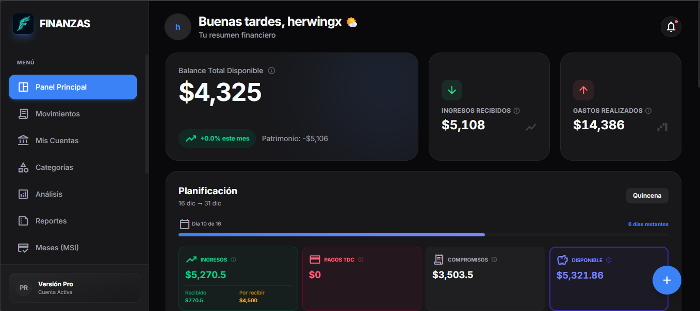

# 💰 Finanzas Pro

> **Sistema integral de gestión financiera personal** — Self-hosted, privado y completamente tuyo.

[](https://www.typescriptlang.org/)
[](https://react.dev/)
[](https://expressjs.com/)
[](https://www.postgresql.org/)
[](https://www.docker.com/)
[](LICENSE)
[](https://github.com/herwingx/finanzas-pro/actions/workflows/deploy.yml)
<!-- Topics: finance, self-hosted, personal-management, react, typescript, nodejs, postgresql, docker, pwa, budget-app -->

<p align="center">
  
</p>

---

## ✨ Características

| Característica          | Descripción                                    |
| :---------------------- | :--------------------------------------------- |
| 🏦 **Multi-cuenta**      | Gestiona cuentas de débito, crédito y efectivo |
| 💳 **Compras MSI**       | Control de compras a meses sin intereses       |
| 🔄 **Recurrentes**       | Automatiza ingresos y gastos fijos             |
| 💸 **Préstamos**         | Registra dinero prestado o debido              |
| 📊 **Regla 50/30/20**    | Análisis financiero inteligente                |
| 📱 **Mobile-First**      | PWA optimizada con gestos swipe                |
| 🌓 **Tema Oscuro/Claro** | Diseño premium adaptativo                      |
| 🔒 **Self-Hosted**       | Tus datos, tu servidor                         |

---

## 🚀 Inicio Rápido

### Requisitos

- Docker y Docker Compose v2+
- (Opcional) Dominio con Cloudflare para acceso externo

### 1. Clonar el repositorio

```bash
git clone https://github.com/herwingx/finanzas-pro.git
cd finanzas-pro
```

### 2. Configurar variables de entorno

```bash
# Copiar plantillas
cp .env.example .env
cp backend/.env.example backend/.env

# Editar con tus valores
nano .env
nano backend/.env
```

**`.env` (raíz):**
```env
POSTGRES_USER=finanzas
POSTGRES_PASSWORD=tu_password_segura
POSTGRES_DB=finanzas_pro

# Solo si usas Cloudflare Tunnel (recomendado para Home Lab)
CLOUDFLARE_TUNNEL_TOKEN=eyJ...
```

**`backend/.env`:**
```env
DATABASE_URL="postgresql://finanzas:tu_password@db:5432/finanzas_pro"
JWT_SECRET="genera-un-string-aleatorio-largo"
PORT=4000
```

### 3. Iniciar la aplicación

```bash
# Dar permisos al script
chmod +x deploy.sh

# Iniciar todos los servicios
./deploy.sh start
```

### 4. Acceder

- **Con Cloudflare Tunnel**: `https://tu-dominio.com`
- **Red local**: `http://IP-SERVIDOR:3000`

---

## 🏗️ Arquitectura

```mermaid
graph TD
    subgraph Internet
        User([User])
    end

    subgraph "Cloudflare Network"
        CF[Cloudflare Tunnel]
    end

    subgraph "Home Lab / Server"
        Nginx[Nginx Reverse Proxy]
        
        subgraph "Docker Network"
            Frontend[Frontend (React/Vite)]
            Backend[Backend (Express)]
            DB[(PostgreSQL)]
        end
    end

    User <-->|HTTPS| CF
    CF <-->|Tunnel| Nginx
    
    User -.->|LAN :3000| Nginx

    Nginx <-->|/api| Backend
    Nginx <-->|/*| Frontend
    
    Backend <--> DB
```

---

## 📦 Opciones de Despliegue

| Método                | Archivo                         | Ideal para                     |
| :-------------------- | :------------------------------ | :----------------------------- |
| **Cloudflare Tunnel** | `docker-compose.yml`            | Home Lab (sin exponer puertos) |
| **Self-Hosted**       | `docker-compose.selfhosted.yml` | VPS, LAN, tras proxy propio    |

### Cloudflare Tunnel (Recomendado para Home Lab)

Acceso seguro desde Internet sin abrir puertos en tu router.

```bash
# Usa el docker-compose principal
./deploy.sh start
```

> 📘 Ver guía completa: [docs/DEPLOYMENT.md](./docs/DEPLOYMENT.md)

### Self-Hosted (Puertos expuestos)

Para uso en red local o detrás de tu propio reverse proxy.

```bash
docker compose -f docker-compose.selfhosted.yml up -d
```

---

## 🔧 Comandos Útiles

El script `deploy.sh` simplifica la gestión:

```bash
./deploy.sh start     # Iniciar servicios
./deploy.sh stop      # Detener servicios
./deploy.sh restart   # Reiniciar servicios
./deploy.sh update    # Actualizar (git pull + rebuild)
./deploy.sh logs      # Ver logs en tiempo real
./deploy.sh status    # Estado de los contenedores
./deploy.sh backup    # Crear backup de la BD
./deploy.sh migrate   # Ejecutar migraciones Prisma
./deploy.sh db        # Conectar a PostgreSQL CLI
./deploy.sh help      # Ver ayuda
```

---

## 📚 Documentación

| Documento                                 | Descripción                      |
| :---------------------------------------- | :------------------------------- |
| [DEPLOYMENT.md](./docs/DEPLOYMENT.md)     | Guía completa de despliegue      |
| [CI_CD.md](./docs/CI_CD.md)               | Configurar despliegue automático |
| [BACKUP.md](./docs/BACKUP_GUIDE.md)       | Sistema de backups               |
| [SECURITY.md](./docs/SECURITY.md)         | Configuración de seguridad       |
| [CONTRIBUTING.md](./docs/CONTRIBUTING.md) | Guía para contribuidores         |

---

## 🛠️ Stack Tecnológico

### Frontend
- **React 18** + TypeScript
- **Vite** (build tool)
- **TailwindCSS** (estilos)
- **TanStack Query** (estado del servidor)
- **React Router** (navegación)
- **Recharts** (gráficos)

### Backend
- **Express 5** + TypeScript
- **Prisma ORM** (base de datos)
- **PostgreSQL 16** (almacenamiento)
- **JWT** (autenticación)
- **bcrypt** (hash de contraseñas)

### Infraestructura
- **Docker Compose** (orquestación)
- **Nginx** (reverse proxy)
- **Cloudflare Tunnels** (acceso seguro)

---

## 🔒 Seguridad

Finanzas Pro implementa múltiples capas de seguridad:

- ✅ Contraseñas hasheadas con bcrypt
- ✅ Autenticación JWT con expiración
- ✅ Rate limiting en endpoints sensibles
- ✅ Headers de seguridad HTTP (Helmet)
- ✅ CORS configurado
- ✅ Sin exposición de puertos (con Cloudflare)

> 📘 Ver configuración detallada: [docs/SECURITY.md](./docs/SECURITY.md)

---

## 🤝 Contribuir

¡Las contribuciones son bienvenidas! 

1. Fork del repositorio
2. Crear rama: `git checkout -b feat/nueva-funcionalidad`
3. Commit: `git commit -m "feat: descripción"`
4. Push: `git push origin feat/nueva-funcionalidad`
5. Crear Pull Request

> 📘 Ver guía completa: [docs/CONTRIBUTING.md](./docs/CONTRIBUTING.md)

---

## 📄 Licencia

Este proyecto está bajo la licencia MIT. Ver [LICENSE](LICENSE) para más detalles.

---

## 🙏 Agradecimientos

- [React](https://react.dev/)
- [Express](https://expressjs.com/)
- [Prisma](https://www.prisma.io/)
- [TailwindCSS](https://tailwindcss.com/)
- [Cloudflare](https://www.cloudflare.com/)

---

<p align="center">
  Hecho con ❤️ para la comunidad self-hosted
</p>
