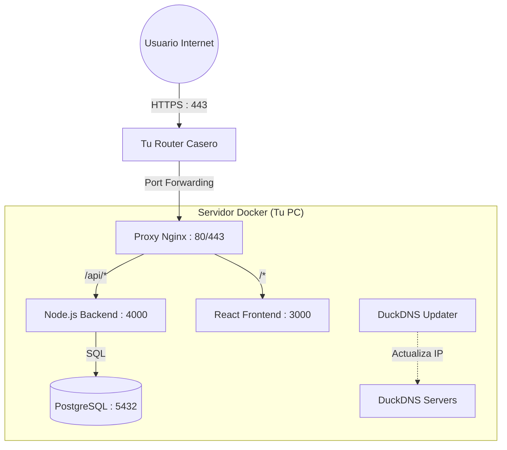

# 💰 Finanzas Pro - Aplicación de Gestión Financiera

Finanzas Pro es una aplicación full-stack diseñada para ayudarte a tomar el control de tus finanzas personales. Permite registrar ingresos y gastos, categorizarlos, gestionar transacciones recurrentes y analizar tus hábitos financieros con reportes detallados.

---

## 🏗️ Cómo Funciona la App (Arquitectura)

La aplicación utiliza **Docker** para ejecutarse, lo que significa que cada parte del sistema vive en su propio contenedor aislado.

### Diagrama de Comunicación



### Explicación Sencilla

1.  **El Usuario** (tú o tu familiar) entra a `https://controlfinanzas.duckdns.org` desde su celular.
2.  **Tu Router** recibe la visita y la manda a tu PC (gracias a que abriste los puertos).
3.  **Nginx (El Portero)** recibe la visita y decide:
    - ¿Quiere ver la página? -> Le muestra el **Frontend**.
    - ¿Quiere guardar un gasto? -> Le manda los datos al **Backend**.
4.  **Backend** guarda los datos en la **Base de Datos** de forma segura.
5.  **DuckDNS** vigila tu IP de internet. Si tu compañía de internet te cambia la IP, este robot avisa al mundo automáticamente en 5 minutos o menos.

---

## 🐳 ¿Por qué usamos Docker? (Beneficios)

1.  **Resiliencia (Soporta apagones):**
    - Hemos configurado `restart: unless-stopped`. Si se va la luz en tu casa, cuando vuelva y prendas la PC, **la aplicación arrancará sola**.
2.  **Seguridad:**
    - La base de datos está aislada. Si algún virus entra a tu PC, es difícil que afecte los datos dentro del contenedor.
3.  **Portabilidad:**
    - Si cambias de computadora, solo copias la carpeta, instalas Docker y corres un comando. Todo funcionará igual.

---

## 🔒 ¿Cómo funciona el SSL (Candadito Verde)?

Para que tu aplicación sea segura y nadie pueda interceptar tus datos financieros, usamos **SSL/HTTPS**. Así funciona en nuestro sistema:

1.  **Let's Encrypt:** Es una entidad gratuita que emite certificados de seguridad.
2.  **El Script (`install_ssl.sh`):**
    - Detiene momentáneamente tu servidor web.
    - Llama Certbot para hablar con Let's Encrypt.
    - Let's Encrypt verifica que controlas `controlfinanzas.duckdns.org` conectándose a tu IP pública (por eso la configuración del router `0.0.0.0 ~ 255.255.255.255` es vital).
    - Si todo está bien, te entrega el certificado.
3.  **Nginx:** Usa ese certificado para proteger tu conexión.

---

## 🚀 Guía de Instalación (Completa)

### Paso 1: Configurar Variables

Asegúrate de tener tu archivo `.env` en la raíz con tus datos de DuckDNS:

```bash
# .env
DUCKDNS_SUBDOMAIN=controlfinanzas
DUCKDNS_TOKEN=tu-token-largo-de-duckdns
```

### Paso 2: Arrancar el Sistema

En la terminal, dentro de la carpeta del proyecto:

```bash
docker compose up -d
```

_Esto descarga e inicia todos los servicios._

### Paso 3: Configurar el HTTPS Seguro (Candadito Verde)

Como ya **abriste los puertos 80 y 443** en tu router:

1.  Asegúrate de que puedes entrar a `http://controlfinanzas.duckdns.org` (aunque diga "No seguro").
2.  Ejecuta este comando para instalar el certificado automáticamente:

    ```bash
    ./install_ssl.sh
    ```

3.  El script te dirá que los certificados se crearon. Ahora debes editar `nginx/nginx.conf` y descomentar las líneas de SSL (te lo indicará el archivo).
4.  Reinicia Nginx: `docker compose restart nginx`

¡Listo! Ahora tu app es segura.

---

## 🛠️ Mantenimiento

- **Ver si todo está funcionando:**
  ```bash
  docker compose ps
  ```
- **Ver si hay errores (logs):**
  ```bash
  docker compose logs -f
  ```
- **Actualizar la app (si cambias código):**
  ```bash
  docker compose up -d --build
  ```
- **Hacer copia de seguridad de tus datos:**
  ```bash
  docker compose exec db pg_dump -U herwingx finanzas_pro > respaldo_finanzas.sql
  ```

---

## 📁 Estructura del Proyecto

- `docker-compose.yml`: El archivo maestro que conecta todo.
- `frontend/`: La página web (React).
- `backend/`: El cerebro que procesa datos (Node.js).
- `nginx/`: El servidor web público.
- `install_ssl.sh`: Tu herramienta mágica para el HTTPS.
