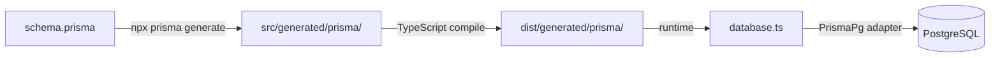
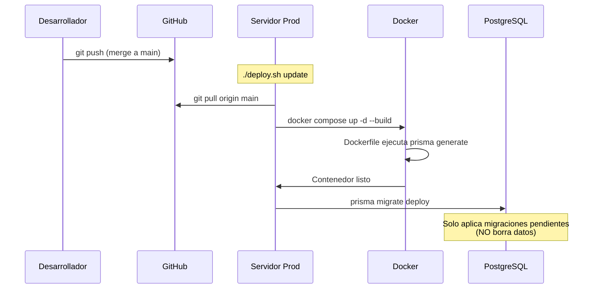

# 💰 Finanzas Pro

> **Sistema integral de gestión financiera personal** — Self-hosted, privado, open source y completamente tuyo.

[](https://www.typescriptlang.org/)
[](https://react.dev/)
[](https://expressjs.com/)
[](https://www.postgresql.org/)
[](https://www.docker.com/)
[](LICENSE)
[](https://github.com/herwingx/finanzas-pro/actions/workflows/deploy.yml)

<p align="center">
  
</p>

---

## 📋 Tabla de Contenidos

- [✨ Características](#-características)
- [⚡ Inicio Rápido](#-inicio-rápido)
- [🛠️ Desarrollo Local](#️-desarrollo-local)
  - [🗄️ Prisma 7 - Base de Datos](#️-prisma-7---cliente-de-base-de-datos)
- [🚀 Despliegue en Producción](#-despliegue-en-producción)
- [🐳 Opciones de Docker Compose](#-opciones-de-docker-compose)
- [🔐 Variables de Entorno](#-variables-de-entorno)
- [🏗️ Arquitectura](#️-arquitectura)
- [📚 Documentación](#-documentación)
- [🤝 Contribuir](#-contribuir)

---

## ✨ Características

| Característica          | Descripción                                    |
| :---------------------- | :--------------------------------------------- |
| 🏦 **Multi-cuenta**      | Gestiona cuentas de débito, crédito y efectivo |
| 💳 **Compras MSI**       | Control de compras a meses sin intereses       |
| 🔄 **Recurrentes**       | Automatiza ingresos y gastos fijos             |
| 💸 **Préstamos**         | Registra dinero prestado o debido              |
| 📊 **Regla 50/30/20**    | Análisis financiero inteligente                |
| 📱 **Mobile-First**      | PWA optimizada con gestos swipe                |
| 🌓 **Tema Oscuro/Claro** | Diseño premium adaptativo                      |
| 🔒 **Self-Hosted**       | Tus datos, tu servidor                         |

---

## ⚡ Inicio Rápido

### Clonar el Repositorio

```bash
git clone https://github.com/herwingx/finanzas-pro.git
cd finanzas-pro
```

### Configuración en 1 Paso

```bash
# Copia las plantillas de variables de entorno
cp .env.example .env
cp backend/.env.example backend/.env
cp frontend/.env.example frontend/.env
```

> 📘 **Nota:** Los archivos `.env.example` vienen preconfigurados para **desarrollo local**. ¡Funcionan inmediatamente!

---

## 🛠️ Desarrollo Local

Para contribuir o desarrollar nuevas funcionalidades, usa el entorno de desarrollo que proporciona **hot-reload**.

### Configuración Inicial (Primera Vez)

```bash
# Dar permisos al script
chmod +x dev.sh

# Ejecutar setup completo
./dev.sh setup
```

Este comando:
1. ✅ Copia `.env.example` → `.env` (raíz, backend, frontend)
2. ✅ Inicia PostgreSQL local (Docker, puerto 5432)
3. ✅ Instala dependencias de backend y frontend
4. ✅ Genera cliente Prisma
5. ✅ Ejecuta migraciones

### Flujo de Trabajo Diario

```bash
# 1. Iniciar base de datos
./dev.sh start

# 2. En Terminal 1 - Backend (con hot-reload)
cd backend && npm run dev

# 3. En Terminal 2 - Frontend (con hot-reload)
cd frontend && npm run dev
```

**URLs de desarrollo:**

| Servicio      | URL                         |
| :------------ | :-------------------------- |
| Frontend      | `http://localhost:5173`     |
| Backend API   | `http://localhost:4000/api` |
| Prisma Studio | `./dev.sh studio`           |

### Comandos de Desarrollo

| Comando             | Descripción                               |
| :------------------ | :---------------------------------------- |
| `./dev.sh setup`    | Configuración inicial completa            |
| `./dev.sh start`    | Inicia PostgreSQL y muestra instrucciones |
| `./dev.sh stop`     | Detiene PostgreSQL                        |
| `./dev.sh migrate`  | Aplica nuevas migraciones de Prisma       |
| `./dev.sh studio`   | Abre Prisma Studio (UI para la BD)        |
| `./dev.sh db-reset` | Elimina y recrea la BD (¡borra datos!)    |

### 🗄️ Prisma 7 - Cliente de Base de Datos

Este proyecto usa **Prisma 7** con la nueva arquitectura sin motor Rust. Esto significa:

- ✅ **Builds más rápidos** - No se descarga el query engine binario
- ✅ **Bundles más pequeños** - Menos dependencias en producción
- ✅ **Driver Adapters** - Conexión nativa con PostgreSQL via `pg`

#### Archivos de Configuración

| Archivo                            | Propósito                                    |
| :--------------------------------- | :------------------------------------------- |
| `backend/prisma/schema.prisma`     | Define modelos, relaciones y enums           |
| `backend/prisma.config.ts`         | Configura el CLI (URL para migraciones)      |
| `backend/src/generated/prisma/`    | Cliente generado (no se sube a Git)          |
| `backend/src/services/database.ts` | Inicializa el cliente con el adapter de `pg` |

#### Flujo del Cliente Prisma



#### Regenerar el Cliente

Si modificas `schema.prisma`, debes regenerar el cliente:

```bash
cd backend

# Regenerar cliente (después de cambiar modelos)
npx prisma generate

# Crear y aplicar migración (si cambiaste el schema)
npx prisma migrate dev --name "descripcion_del_cambio"
```

> 📘 **Nota:** El cliente generado está en `.gitignore`. Se regenera automáticamente en el Dockerfile y con `./dev.sh setup`.

---

## 🚀 Despliegue en Producción

### Pre-requisitos

- Docker y Docker Compose v2+
- (Opcional) Dominio configurado en Cloudflare

### Paso 1: Configurar Variables de Entorno

```bash
# Copiar plantillas
cp .env.example .env
cp backend/.env.example backend/.env
cp frontend/.env.example frontend/.env

# Editar con valores de producción
nano .env            # Ver sección "Variables de Entorno" abajo
nano backend/.env    # Cambiar DATABASE_URL, JWT_SECRET, etc.
```

### Paso 2: Elegir Método de Despliegue

Ver sección [🐳 Opciones de Docker Compose](#-opciones-de-docker-compose) para elegir según tu infraestructura.

### Paso 3: Iniciar Servicios

```bash
chmod +x deploy.sh
./deploy.sh start
```

### Comandos de Producción

| Comando               | Descripción                         |
| :-------------------- | :---------------------------------- |
| `./deploy.sh start`   | Inicia todos los servicios          |
| `./deploy.sh stop`    | Detiene todos los servicios         |
| `./deploy.sh update`  | Pull de Git + rebuild + migraciones |
| `./deploy.sh logs`    | Muestra logs en tiempo real         |
| `./deploy.sh status`  | Estado de los servicios             |
| `./deploy.sh backup`  | Crea backup de la base de datos     |
| `./deploy.sh migrate` | Ejecuta migraciones de Prisma       |

### 🔄 Flujo de Actualización en Producción



> ⚠️ **Importante sobre migraciones:**
> - `prisma migrate dev` → **Solo en desarrollo** (puede resetear datos)
> - `prisma migrate deploy` → **En producción** (solo aplica pendientes, seguro)
> - El Dockerfile ya incluye `prisma generate` automáticamente

---

## 🐳 Opciones de Docker Compose

Finanzas Pro incluye **3 configuraciones** de Docker Compose para diferentes escenarios:

| Archivo                         | Uso                      | Cuándo Usarlo                   |
| :------------------------------ | :----------------------- | :------------------------------ |
| `docker-compose.dev.yml`        | Solo PostgreSQL          | Desarrollo local con hot-reload |
| `docker-compose.yml`            | Full + Cloudflare Tunnel | Producción con dominio propio   |
| `docker-compose.selfhosted.yml` | Full + puertos expuestos | LAN, Tailscale, VPN             |

### 1. Desarrollo Local (`docker-compose.dev.yml`)

Solo levanta PostgreSQL. Backend y frontend corren localmente con `npm run dev`.

```bash
# Automático con script
./dev.sh start

# Manual
docker compose -f docker-compose.dev.yml up -d
```

### 2. Producción con Cloudflare (`docker-compose.yml`) — Recomendado

Incluye Cloudflare Tunnel para acceso seguro sin abrir puertos.

```bash
# Requiere: CLOUDFLARE_TUNNEL_TOKEN en .env
./deploy.sh start

# O manual
docker compose up -d
```

**Ventajas:**
- ✅ SSL automático
- ✅ Sin abrir puertos en tu router/firewall
- ✅ Protección DDoS incluida
- ✅ Acceso desde cualquier lugar

### 3. Self-Hosted / Tailscale (`docker-compose.selfhosted.yml`)

Expone puertos directamente. Ideal para:
- Acceso solo en red local (LAN)
- Uso con Tailscale o VPN
- Detrás de un reverse proxy existente (Traefik, Caddy)

```bash
docker compose -f docker-compose.selfhosted.yml up -d

# Con Nginx opcional (puerto 80)
docker compose -f docker-compose.selfhosted.yml --profile with-nginx up -d
```

**Puertos expuestos:**

| Servicio         | Puerto |
| :--------------- | :----- |
| Frontend         | `3000` |
| Backend          | `4000` |
| PostgreSQL       | `5432` |
| Nginx (opcional) | `80`   |

---

## 🔐 Variables de Entorno

### Estrategia de Configuración

| Archivo        | Propósito                                |
| :------------- | :--------------------------------------- |
| `.env.example` | Plantilla con valores de **desarrollo**  |
| `.env`         | Tu configuración real (ignorado por Git) |

> 📘 Los `.env.example` funcionan **inmediatamente para desarrollo**. Para producción, ajusta los valores indicados con `# PROD:`.

---

### Variables Raíz (`.env`)

Configura la infraestructura Docker.

| Variable                  | Desarrollo              | Producción               | Descripción                    |
| :------------------------ | :---------------------- | :----------------------- | :----------------------------- |
| `POSTGRES_USER`           | `finanzas`              | `finanzas`               | Usuario de PostgreSQL          |
| `POSTGRES_PASSWORD`       | `devfinanzas`           | **Tu password seguro**   | Contraseña de PostgreSQL       |
| `POSTGRES_DB`             | `finanzas_pro`          | `finanzas_pro`           | Nombre de la base de datos     |
| `CLOUDFLARE_TUNNEL_TOKEN` | (vacío)                 | **Tu token**             | Token de Cloudflare Zero Trust |
| `ALLOWED_ORIGINS`         | `http://localhost:5173` | `https://tu-dominio.com` | CORS: orígenes permitidos      |
| `RATE_LIMIT_ENABLED`      | `false`                 | `true`                   | Protección contra fuerza bruta |
| `REGISTRATION_ENABLED`    | `true`                  | `false`                  | Permite registro de usuarios   |
| `TELEGRAM_ENABLED`        | `false`                 | `true` (opcional)        | Notificaciones de backups      |
| `TELEGRAM_BOT_TOKEN`      | (vacío)                 | Tu token                 | Token de @BotFather            |
| `TELEGRAM_CHAT_ID`        | (vacío)                 | Tu chat ID               | ID de @userinfobot             |

---

### Variables Backend (`backend/.env`)

Configura la lógica de la aplicación.

| Variable               | Desarrollo                   | Producción               | Descripción                  |
| :--------------------- | :--------------------------- | :----------------------- | :--------------------------- |
| `DATABASE_URL`         | `...@localhost:5432/...`     | `...@db:5432/...`        | Host cambia a `db` en Docker |
| `PORT`                 | `4000`                       | `4000`                   | Puerto interno del backend   |
| `NODE_ENV`             | `development`                | `production`             | Modo de ejecución            |
| `JWT_SECRET`           | `dev-jwt-secret...`          | `openssl rand -hex 32`   | Secreto para firmar tokens   |
| `APP_URL`              | `http://localhost:5173`      | `https://tu-dominio.com` | URL para enlaces en emails   |
| `ALLOWED_ORIGINS`      | `http://localhost:5173,3000` | `https://tu-dominio.com` | CORS                         |
| `RATE_LIMIT_ENABLED`   | `false`                      | `true`                   | Limita intentos de login     |
| `REGISTRATION_ENABLED` | `true`                       | `false`                  | Control de registro          |
| `ENABLE_CRON_JOBS`     | `false`                      | `true`                   | Tareas programadas           |

**SMTP (opcional, para recuperación de contraseña):**

| Variable      | Ejemplo Gmail                          |
| :------------ | :------------------------------------- |
| `SMTP_HOST`   | `smtp.gmail.com`                       |
| `SMTP_PORT`   | `587`                                  |
| `SMTP_SECURE` | `false`                                |
| `SMTP_USER`   | `tu-email@gmail.com`                   |
| `SMTP_PASS`   | `tu-app-password` (16 chars)           |
| `SMTP_FROM`   | `Finanzas Pro <noreply@tudominio.com>` |

> 📘 Gmail requiere [App Password](https://myaccount.google.com/apppasswords)

---

### Variables Frontend (`frontend/.env`)

| Variable                    | Desarrollo                  | Producción | Descripción                 |
| :-------------------------- | :-------------------------- | :--------- | :-------------------------- |
| `VITE_API_URL`              | `http://localhost:4000/api` | `/api`     | Ruta relativa en producción |
| `VITE_GOOGLE_GENAI_API_KEY` | (opcional)                  | (opcional) | API key de Gemini AI        |

---

### Ejemplo: Migración de Desarrollo a Producción

```bash
# 1. Copiar desde ejemplo
cp .env.example .env

# 2. Editar valores críticos
nano .env
```

**Cambios mínimos para producción:**

```bash
# .env (raíz)
POSTGRES_PASSWORD=MiPasswordSeguro2024!
CLOUDFLARE_TUNNEL_TOKEN=eyJ...
ALLOWED_ORIGINS=https://finanzas.midominio.com
RATE_LIMIT_ENABLED=true
REGISTRATION_ENABLED=false

# backend/.env
DATABASE_URL=postgresql://finanzas:MiPasswordSeguro2024!@db:5432/finanzas_pro
NODE_ENV=production
JWT_SECRET=$(openssl rand -hex 32)
APP_URL=https://finanzas.midominio.com
ALLOWED_ORIGINS=https://finanzas.midominio.com
RATE_LIMIT_ENABLED=true
REGISTRATION_ENABLED=false
ENABLE_CRON_JOBS=true

# frontend/.env
VITE_API_URL=/api
```

---

## 🏗️ Arquitectura


- **Frontend**: Single Page Application (SPA) servida estáticamente por Nginx.
- **Backend**: API RESTful que procesa la lógica de negocio.
- **Base de Datos**: PostgreSQL persistente (los datos sobreviven reinicios).
- **Proxy**: Nginx maneja el enrutamiento y puede servir de SSL terminator.

---

## 📚 Documentación Adicional

| Guía                                       | Contenido                                             |
| :----------------------------------------- | :---------------------------------------------------- |
| [📘 Guía de Despliegue](docs/DEPLOYMENT.md) | Opciones avanzadas (Self-hosted, VPS, Cloud).         |
| [🛡️ Seguridad](docs/SECURITY.md)            | Hardening, buenas prácticas y configuración segura.   |
| [💾 Backups](docs/BACKUP_GUIDE.md)          | Cómo respaldar y restaurar tu información financiera. |
| [🔄 CI/CD](docs/CI_CD.md)                   | Pipelines de GitHub Actions para despliegue continuo. |
| [🤝 Contribuir](docs/CONTRIBUTING.md)       | Estándares de código y cómo enviar PRs.               |

---

## 🤝 Contribuir

¡Tu ayuda es vital para mantener este proyecto Open Source y de alta calidad!

1. Revisa [CONTRIBUTING.md](docs/CONTRIBUTING.md) para conocer las normas.
2. Crea un **Fork** del proyecto.
3. Desarrolla tu mejora en una rama nueva (`feat/mi-mejora`).
4. Envía un **Pull Request** detallando tus cambios.

---

## 📄 Licencia

Este proyecto es software libre bajo la licencia [MIT](LICENSE).

<p align="center">
  Hecho con ❤️ para la comunidad Open Source
</p>
