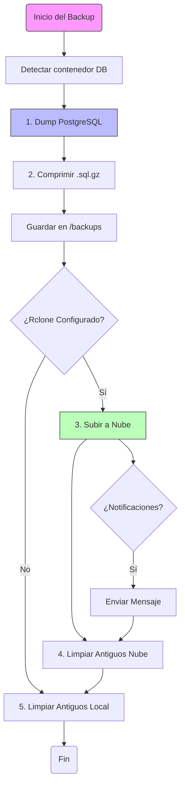

# 💾 Sistema de Backups

> **Tranquilidad Mental** — Estrategias de respaldo automático local y en la nube.

Esta guía explica cómo configurar backups automáticos diarios de tu base de datos con subida opcional a la nube.

---

## 📋 Características

| Característica | Detalle |
| :--- | :--- |
| **Automático** | Backup diario en horario configurable (cron). |
| **Retención** | Mantiene los últimos 7 días (configurable). |
| **Compresión** | Usa `gzip` para ahorrar espacio. |
| **Nube** | Sincronización automática con Google Drive, Dropbox, S3, etc. |
| **Notificaciones** | Avisos por Telegram al completar o fallar. |
| **Restauración** | Menú interactivo para recuperar datos fácilmente. |



---

## 🚀 Configuración Rápida

### 1. Preparar el script
El script ya viene incluido en el repositorio. Solo asegúrate de que sea ejecutable:

```bash
chmod +x scripts/backup.sh
```

### 2. Prueba manual (Local)
Ejecuta esto para verificar que la conexión a la base de datos funciona y se crea el archivo.

```bash
./scripts/backup.sh --local-only
```
*Deberías ver un nuevo archivo en la carpeta `backups/`.*

### 3. Configurar Backup Automático
El script puede auto-configurar el cron job por ti.

```bash
./scripts/backup.sh --setup-cron
```
*Sigue las instrucciones en pantalla para elegir la hora del backup.*

---

## ☁️ Configuración de Nube (Opcional)

Para máxima seguridad, recomendamos subir los backups a la nube usando **rclone**.

### 1. Instalar rclone
```bash
curl https://rclone.org/install.sh | sudo bash
```

### 2. Configurar Integración
```bash
rclone config
```
*Sigue el asistente interactivo para conectar Google Drive, Dropbox, OneDrive, S3, etc. Nombra tu conexión (ej: `gdrive`)*.

### 3. Activar en el Script
Edita las variables de entorno o expórtalas en tu sistema:

```bash
# Define el nombre del remote que configuraste en rclone
export RCLONE_REMOTE=gdrive

# (Opcional) Define la ruta dentro de la nube
export RCLONE_PATH=backups-finanzas
```

---

## 📱 Notificaciones (Telegram)

Recibe un mensaje en tu móvil cada vez que se haga un backup.

1. Crea un bot con `@BotFather` y obtén el **Token**.
2. Obtén tu ID de usuario con `@userinfobot`.
3. Configura las variables:

```bash
export TELEGRAM_ENABLED=true
export TELEGRAM_BOT_TOKEN="123456:ABC-DEF..."
export TELEGRAM_CHAT_ID="987654321"
```

---

## 🛠️ Comandos de Referencia

| Acción | Comando |
| :--- | :--- |
| **Ayuda** | `./scripts/backup.sh --help` |
| **Estado** | `./scripts/backup.sh --status` |
| **Backup Manual** | `./scripts/backup.sh` |
| **Restaurar** | `./scripts/backup.sh --restore` |

### Restauración
El modo restauración es interactivo. Te mostrará una lista de los backups disponibles y podrás elegir cual aplicar.

> ⚠️ **Advertencia**: Restaurar un backup **sobreescribirá** la base de datos actual. Asegúrate de lo que haces.

---

## ⚙️ Variables Avanzadas

Puedes personalizar el comportamiento editando el inicio del archivo `scripts/backup.sh` o mediante variables de entorno.

| Variable | Default | Descripción |
| :--- | :--- | :--- |
| `BACKUP_RETENTION_DAYS` | `7` | Días a conservar los archivos. |
| `POSTGRES_CONTAINER` | Autodetect | Nombre del contenedor Docker de la DB. |
| `POSTGRES_USER` | `finanzas` | Usuario de la base de datos. |
| `POSTGRES_DB` | `finanzas_pro` | Nombre de la base de datos. |

---

## 🆘 Solución de Problemas

**Error: "Container not found"**
Si cambiaste el nombre del contenedor en `docker-compose.yml`, expórtalo manualmente:
```bash
export POSTGRES_CONTAINER=nombre_personalizado_db
./scripts/backup.sh
```

**Logs**
Revisa el historial de ejecuciones en:
```bash
tail -f backups/backup.log
```
