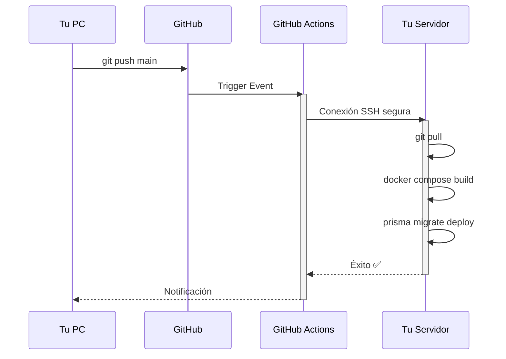

# 🔄 CI/CD - Despliegue Automático

> **Automatización Total** — Configura pipelines robustos para desplegar cambios sin esfuerzo.

Esta guía explica cómo configurar **GitHub Actions** para que cada `git push` a `main` actualice automáticamente tu servidor.

---

## 🎯 Flujo de Trabajo


```mermaid
sequenceDiagram
    participant User as Tu PC
    participant GitHub
    participant Actions as GitHub Actions
    participant Server as Tu Servidor

    User->>GitHub: git push main
    GitHub->>Actions: Trigger Event
    activate Actions
    Actions->>Server: Conexión SSH segura
    activate Server
    Server->>Server: git pull
    Server->>Server: docker compose build
    Server->>Server: prisma migrate deploy
    Server-->>Actions: Éxito ✅
    deactivate Server
    Actions-->>User: Notificación
    deactivate Actions
```

---

## ⚡ Guía Rápida (SSH Directo)

La forma más sencilla de configurar CI/CD es mediante acceso SSH directo.

### 1. Generar Llaves SSH
En tu ordenador local (NO en el servidor):

```bash
# Genera una llave exclusiva para el deploy
ssh-keygen -t ed25519 -C "github-actions" -f ~/.ssh/github_deploy
```

### 2. Configurar el Servidor
Copia la **llave pública** (`.pub`) al servidor para autorizar el acceso:

```bash
# Copia la llave al servidor
ssh-copy-id -i ~/.ssh/github_deploy.pub usuario@tu-servidor-ip
```

### 3. Configurar GitHub Secrets
Ve a tu repositorio en GitHub: **Settings** → **Secrets and variables** → **Actions**.

Agrega los siguientes secretos:

| Secret | Valor | Descripción |
| :--- | :--- | :--- |
| `SSH_HOST` | `tu-ip-o-dominio.com` | Dirección IP o dominio del servidor. |
| `SSH_USER` | `usuario` | Usuario del sistema (ej: `root`, `ubuntu`). |
| `SSH_PRIVATE_KEY` | *(Contenido de file)* | Copia TODO el contenido de `~/.ssh/github_deploy`. |
| `DEPLOY_PATH` | `/var/www/finanzas-pro` | Ruta absoluta donde clonaste el proyecto. |

---

## 🔒 Opción Cloudflare Tunnel (Más Seguro)

Si usas Cloudflare Tunnel y no quieres abrir el puerto 22, usa este método.

### 1. Configurar Acceso SSH en Cloudflare
1. En **Zero Trust** → **Access** → **Service Auth**, crea un **Service Token**.
2. Guarda el `Client ID` y `Client Secret`.
3. Crea una política en Access que permita acceso SSH usando ese Service Token.

### 2. Configurar GitHub Secrets Adicionales

Añade estos secretos adicionales a los anteriores:

| Secret | Descripción |
| :--- | :--- |
| `CF_ACCESS_CLIENT_ID` | Tu Client ID del Service Token. |
| `CF_ACCESS_CLIENT_SECRET` | Tu Client Secret del Service Token. |

### 3. Uso en el Workflow
El archivo `.github/workflows/deploy.yml` ya está preparado para detectar si configuras estos secretos y usarlos para atravesar el túnel.

---

## 🛡️ Seguridad y Buenas Prácticas

1. **Llaves Dedicadas**: Nunca uses tu llave SSH personal. Genera una específica para CI/CD.
2. **Permisos Mínimos**: Si es posible, crea un usuario `deploy` en el servidor con permisos limitados solo a la carpeta del proyecto y Docker.
3. **Branch Protection**: Activa reglas en la rama `main` para requerir Pull Requests y tests pasando antes del merge.

---

## 🔍 Troubleshooting

**Error: Host key verification failed**
Asegúrate de que la IP del servidor es correcta. El workflow usa `ssh-keyscan` automáticamente, pero firewalls agresivos pueden bloquearlo.

**Error: Permission denied (publickey)**
Verifica que copiaste la llave **privada** (sin extensión) a GitHub y la **pública** (`.pub`) al `authorized_keys` del servidor.

**El deploy no actualiza cambios**
Asegúrate de que el usuario SSH tiene permisos de escritura en la carpeta `DEPLOY_PATH`.

```bash
# En el servidor
sudo chown -R usuario:usuario /ruta/del/proyecto
```
